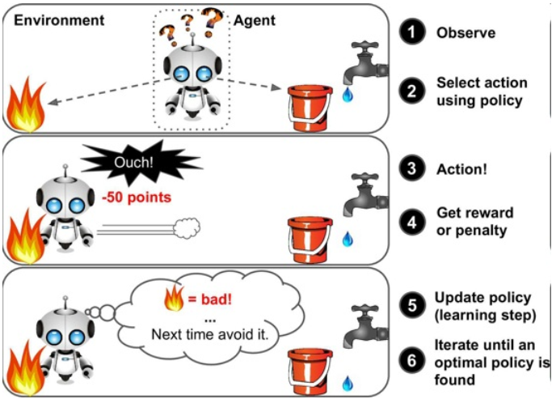
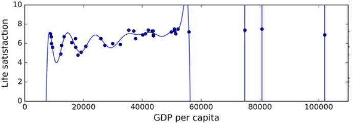

# 机器学习概述
## 1 机器学习的种类
机器学习可以根据以下内容进行分类

是否在人类监督下训练（**监督式学习**，**无监督式学习**，**半监督式学习**和**强化学习**）

是否可以动态的进行增量学习（**在线学习**和**批量学习**）

是简单的将新的数据点和已知的数据点进行匹配，还是像科学家一样，对训练数据进行模式检测，然后建立一个预测模型（**基于实例的学习**和**基于模型的学习**）

这些标准之间互相并不排斥，可以任意组合

>监督式/无监督式/半监督式学习

监督式学习和无监督式学习的主要区别就是使用的训练数据里是否包含`标签`（答案）。比如垃圾邮件的分类，在对其进行数据训练时，我们会标记当前的邮件是常规邮件还是垃圾邮件，这种训练方式就是监督式的学习。

顾名思义，无监督式学习的训练数据是没有标签的。常用来做聚类学习，例如现在有大量的关于微信公众号的访客数据，希望对这些访客进行一个分组，有着相似兴趣的访客分为一组，在这种情况下我们不大可能告诉机器哪个访客属于哪个分组，无监督式学习则会自己去寻找这种关联。

半监督式学习则是可以处理部分带有标签的训练数据——通常是大量未标记数据和少量的标记数据。

下面是一些监督式学习的算法

* K-近邻算法
* 线性回归
* 逻辑回归
* 支持向量机
* 决策树和随机森林
* `神经网络`

>强化学习

强化学习的学习系统能够观察环境，做出选择，执行操作，并获得回报/惩罚。例如许多机器人就是通过强化学习算法来学习如何行走。下面这张图生动形象的体现了什么是强化学习。

>批量学习与在线学习

批量学习的意思就是一次性对所有可用数据进行训练，每当有新的数据加入进来，都需要重新对整个数据集进行训练。这种训练方式虽然简单，但是每次训练都需要花费大量的时间以及计算资源（CPU，内存空间，磁盘空间，磁盘/网络I/O等）。

在线学习则是循序渐进的给系统提供训练数据，逐步累积学习成果，非常的迅速与便利。但同样会遇到一个问题，在线学习中有一个重要的参数是其适应不断变化数据的速度，称为`学习率`。如果设置的学习率很高，系统会很快适应新数据，但同时也会很快忘记旧数据。反之，如果设置很低，则会学习的很缓慢。

*注：在线学习整个过程通常也是离线完成的，这个名字很容易让人产生误解*

>基于实例与基于模型的学习

基于实例的学习类似于我们说的“死记硬背”，比如当我们需要判断一个新的邮件是否是垃圾邮件，我们拿这个新邮件与已知的邮件进行相似性度量，与哪封邮件最相似就判断其为什么类型的邮件。

基于模型的学习则类似于我们通常所说的线性回归，假设二维坐标存在一组数据是在一条直线上下波动的，这时候我们就可以设定一个模型y=ax+b，来根据已有的数据得到a,b的一个最优值来预测新的x对应的y的值。

## 2 机器学习的主要挑战

>训练数据

* 训练数据数量不足：大部分机器学习算法需要大量的数据才能正常工作，即使是最简单的问题，很可能也需要成千上万个示例。
* 训练数据不具备代表性：即使样本数据量非常大，但如果采样方式欠妥，同样可能导致非代表性数据。
* 训练数据质量差：有的训练集满是错误，异常值和噪声，最后得到的训练结果是不太可能表现良好的。

>训练算法

* 训练数据过度拟合：如下图所示，模型虽然在训练数据上表现良好，但是应用在其他情况时却会不尽如人意。可以用超参数来改善这个过拟合的情况。

*注：超参数不是模型中训练的参数，在训练前设置好，在训练期间保持不变*

* 训练数据拟合不足：这通常是由于模型过于简单导致的，如上图所示，如果只用一个简单的线性模型去拟合，则会出现拟合不足的情况。

## 3 测试与验证

我们通常将我们的数据集分为两部分：80%作为训练集训练，20%作为测试集进行测试。而有时候为了让我们的模型的泛化能力更强，需要选择一些正则化超参数的值来训练不同的模型，但此时如果每次都用测试集来测试，这会使得其对于新的数据不太可能有很好的表现，因为多次度量了测试集。

常见的解决方案是再单独分出一个保留集合，成为验证集。为了避免验证集“浪费”太多的训练数据，通常将训练集分为若干个互补子集，每个模型对子集的不同组合来进行训练，剩下的子集则用来验证，一旦模型和超参数都被选定，最后使用测试集测量泛化误差。

## 思考一下

1.列出两种常见的监督式学习任务？

2.什么类型的学习算法依赖相似度来做预测？

3.验证集的目的是什么？

