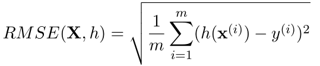

#  机器学习实战

## START
1 在进行实战前，我一直搞不懂为什么要用Linux训练模型而不是用Windows，我也一直没搞懂其优点在哪？

谷歌之后我总结了以下几点（虽然我目前也还没搞懂，小白刚起步）：

* 大部分的深度学习框架对Windows支持并不好。

* 安装命令和安装各种库很方便，很多东西都是基于Linux的。

2 Windows下学习机器学习需要安装什么库？

我在学爬虫的时候安装过anaconda，然后发现初学者所需的库基本已经包含了。

3 均方根误差（RMSE）是回归任务的首选性能衡量指标。

其中X的粗体是关于x向量的矩阵，x是数据集中所有特征值的向量，如x=[经度，纬度，居民数量，平均收入]，y则代表标签，如房价中位数。h(X)代表预测的值。

4 什么是Jupyter？

详情请见知乎大佬的回答：[jupyter notebook 可以做哪些事情？](https://www.zhihu.com/question/46309360/answer/254638807).
